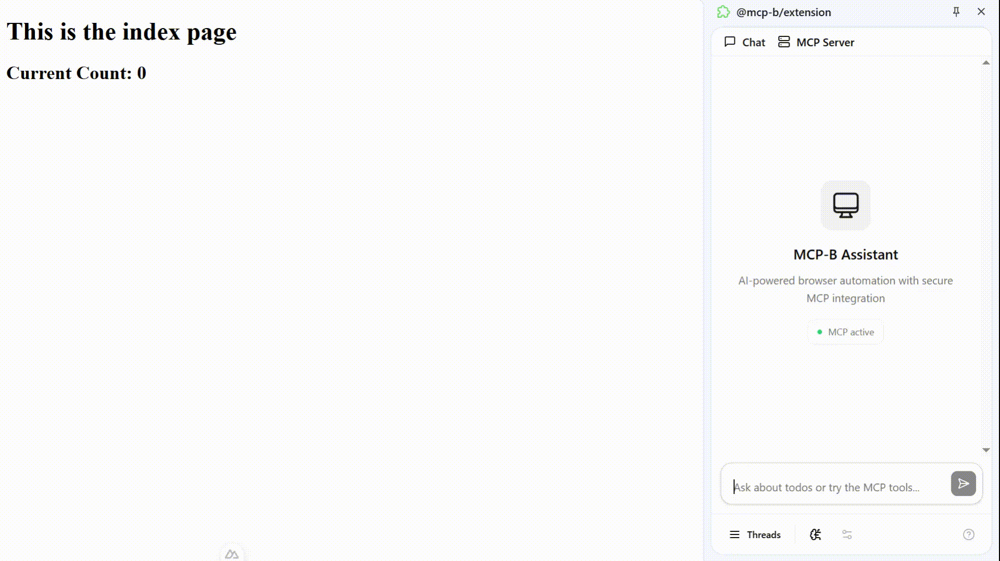

# Nuxt 3 MCP-B Demo

A demo project showcasing integration of MCP-B (Model Context Protocol Browser) with Nuxt 3.

MCP-B allows the website to become a MCP server exposing various tools. Read more about MCP-B [here](https://github.com/MiguelsPizza/WebMCP?tab=readme-ov-file)

The code for the MCP Server and tools are in `app.vue`. Checkout the [composable branch](https://github.com/mikechao/nuxt3-mcp-b-demo/tree/composable) to see how to use MCP-B with a Nuxt 3 composable.

## Features

- Nuxt 3 framework
- MCP-B transports integration
- Model Context Protocol SDK

## Demo



## Setup

### 1. Install the Chrome Extension

Install the [Chrome Extension](https://chromewebstore.google.com/detail/mcp-b/daohopfhkdelnpemnhlekblhnikhdhfa?authuser=0&hl=en)

### 2. Make sure to install dependencies:

```bash
# npm
npm install

# pnpm
pnpm install

# yarn
yarn install

# bun
bun install
```

### 3. Run Development Server

Start the development server on `http://localhost:3000`:

```bash
# npm
npm run dev

# pnpm
pnpm dev

# yarn
yarn dev

# bun
bun run dev
```

